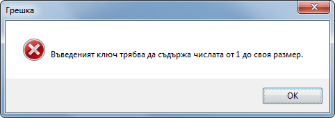

# Cryptography-Project
Implementation and demonstration of the main classical cryptographic ciphers

# КУРСОВ ПРОЕКТ

# Демонстрация и софтуерна имплементация на основните класически криптографски методи (шифри)

# **Съдържание:**

I. [Проучване на проблемната област](#проучване-на-проблемната-област)

  * [Субституционни методи за шифроване](#субституционни-методи-за-шифроване)

    1. [Просто едноазбучно заместване (с разновидност – шифър на Цезар)](#просто-едноазбучно-заместване-с-разновидност-шифър-на-цезар)

    2. [Директно (пряко, просто) заместване](#директно-пряко-просто-заместване)

    3. [Многоазбучно заместване](#многоазбучно-заместване)

    4. [Матрично заместване](#матрично-заместване)

  * [Транспозиционни методи за шифроване](#транспозиционни-методи-за-шифроване)

    1. [Разместване на символи чрез блокуване на текста](#разместване-на-символи-чрез-блокуване-на-текста)

    2. [Разместване на символи чрез форматиране на текста](#разместване-на-символи-чрез-форматиране-на-текста)

II. [Цел и задачи на проекта](#цел-и-задачи-на-проекта)

III. [Програмна реализация](#програмна-реализация)

  1. [CaesarCipher.cs](#caesarciphercs)

  2. [DirectSubstitution.cs](#directsubstitutioncs)

  3. [PolyAlphabeticSubstitution.cs](#polyalphabeticsubstitutioncs)

  4. [MatrixSubstitution.cs](#matrixsubstitutioncs)

  5. [TextBlockCipher.cs](#textblockciphercs)

  6. [ColumnTransposition.cs](#columntranspositioncs)

IV. [Потребителски интерфейс](#потребителски-интерфейс)

V. [Експериментални резултати](#експериментални-резултати)

  * [Субституционни методи](#субституционни-методи)

    1. [Шифър на Цезар](#шифър-на-цезар)

    2. [Директно заместване](#директно-заместване)

    3. [Многоазбучно заместване](#многоазбучно-заместване-1)

    4. [Матрично заместване](#матрично-заместване-1)

  * [Субституционни методи](#субституционни-методи-1)

    1. [Блокуване на текста](#блокуване-на-текста)

    2. [Форматиране на текста](#форматиране-на-текста)
    
VI. [Пояснения](#пояснения)

# Проучване на проблемната област

В криптографията, класическият шифър е вид шифър, използван в миналото,
който днес вече не се прилага. За разлика от съвременните алгоритми,
повечето класически шифри могат да бъдат използвани и на ръка, без нужда
от компютър. Това ги прави лесни за разбиване с модерните технологии.

Към тях спадат простите системи, използвани по времето на Древна Гърция
и Римската империя, по-сложните ренесансови шифри, както и
криптографията прилагана по време на Втората световна война. За разлика
от класическите шифри, съвременната криптография разчита на нови
алгоритми и компютри, разработени от 1970 г. насам.

Класическите шифри могат да бъдат разделени на субституционни и
транспозиционни.

## Субституционни методи за шифроване

Субституционните криптографски методи са методи за шифроване, при които
криптирането се извършва чрез *заместване* на символи. При тях всеки
символ от криптограмата C се получава посредством замяната на съответния
символ от съобщението в явен вид P по определени правила, гарантиращи,
че между символа i от P и символа j от C е налице еднозначно
съответствие. По този начин редът на следване на символите в явния текст
се запазва, но самите символи се променят.

Субституционните методи за шифроване могат да се разделят на няколко
типа в зависимост от характерните особености на процедурите по шифриране
на явния текст и дешифриране на криптограмата. Тези типове са следните:

1.  Просто едноазбучно заместване (с разновидност – шифър на Цезар)

2.  Директно (пряко, просто) заместване

3.  Многоазбучно заместване

4.  Матрично заместване

### Просто едноазбучно заместване (с разновидност – шифър на Цезар)

При този тип шифроване, един символ от явния текст винаги се замества с
един и същ символ в кодирания текст, независимо от позицията си в
текста. Първият познат подобен шифър е използван от Юлий Цезар. Той
принадлежи към т.нар. афинни шифри, при които се използва проста
математическа функция.

Простотата на метода го прави уязвим от атаки. Той не може да скрие
характерното разпределение на символите в използвания език. В различните
езици отделните букви имат различна честота на срещане. Например в
българския, най-често използвани са буквите А, Е, И и О. Знаейки тази
информация (честота на срещане на буквите), атакуващият може лесно да
разбие кода, като замени най-често срещания символ в криптограмата с А,
втория най-често срещан с Е и т.н. до получаване на явния текст.

#### Криптиране

1.  Определяне на множеството от разрешени символи M = {m1,
    m2, …, mn}.

2.  Проверка дали явния текст съдържа символи, които не са част от M.

3.  Преобразуване на явния текст в криптограма, използвайки формулата
    *j* = (*k*1\**i*+*k*2) mod n, където:

    -   *k*1 – коеф. на преобразуване; *k*1 = 1
        (при шифър на Цезар);

    -   *k*2 – коеф. на изместване; *k*2  = 3 (при
        шифър на Цезар);

    -   *i* – пореден номер на символа (в M), който бива заместван;

    -   *j* – пореден номер на символа в М, с който се извършва
        заместването;

    -   *n* - \|M\| (брой на разрешени символи в системата).

#### Декриптиране

1.  За получаване на явния текст от криптограмата се използва формулата
    *j* = *k*1 − 1(*i*−*k*2) *mod* *n*,
    където *k*1 − 1 е мултипликативната инверсия
    на *k*1 по модул *n* и удовлетворява
    условието *k*1*k*1 − 1 = 1 *mod* *n*.

#### Пример

-   k1 = 1

-   k2 = 3

-   {M} = {N}

-   {M} = {А, Б, В, Г, Д, Е, Ж, З, И, Й, К, Л, М, Н, О, П, Р, С, Т, У,
    Ф, Х, Ц, Ч, Ш, Щ, Ъ, Ь, Ю, Я}

-   n = 30

-   P = ПЪСТЪРВА

-   C = ТЯФХЯУЕГ

### Директно (пряко, просто) заместване

При директното заместване се използва второ подредено множество със
същия брой символи като изходното. Заместването може да се извърши с
един символ или с комбинация от няколко, като самото съответствие може
да се реализира с различни по сложност функционални зависимости между M
и N (f:{M} -&gt; {N}).

#### Криптиране

1.  Определяне на множеството от разрешени символи M = {m1,
    m2, …, mn}.

2.  Определяне на множеството от символи за заместване N =
    {n1, n2, …, nn}.

3.  Определяна на функционална зависимост *f* : {*M*} → {*N*}, чрез
    която всеки символ от M се замества със съответния му символ или
    множество от символи в N.

4.  Проверка дали явния текст съдържа символи, които не са част от M.

5.  Извършване на заместването за всеки символ от явния текст,
    използвайки *f*, до получаване на криптограмата.

#### Декриптиране

1.  Заместване на всеки от символите от криптограмата, използвайки
    обратната функция на *f*, до получаване на явния текст.

#### Пример

-   {M} = {А, Б, В, Г, Д, Е, Ж, З, И, Й, К, Л, М, Н, О, П, Р, С, Т, У,
    Ф, Х, Ц, Ч, Ш, Щ, Ъ, Ь, Ю, Я}

-   {N} = {1, 2, 3, 4, 5, 6, 7, 8, 9, 10, 11, 12, 13, 14, 15, 16, 17,
    18, 19, 20, 21, 22, 23, 24, 25, 26, 27, 28, 29, 30}

-   n = 30

-   P = РЕСТИТУЦИЯ

-   C = 17 6 18 19 9 19 29 23 9 30

### Многоазбучно заместване

При многоазбучната субституция всяко срещане на конкретен символ, може
да има различно заместване. Това значи, че връзката между символ от
явния текст и символ от криптирания е 1:N (едно към много).

#### Криптиране

1.  Дефиниране на крайно подредено множеството от разрешени символи M =
    {m1, m2, …, mn}.

2.  Определяне на криптографски ключ, чиито елементи се избират от M.

3.  Проверка дали явния текст съдържа символи, които не са част от M.

4.  Заместване на всеки символ от съобщението в явен вид (P =
    p1, p2, …, pq) със символ от M,
    който се определя с помощта на ключа (K = k1,
    k2, …, km).

5.  Шифроването се извършва по следната схема:

    *i**c*1 = (*i**p*1+*i**k*1) *mod* *n*;

    *i**c*2 = (*i**p*2+*i**k*2) *mod* *n*;

    …………………………..

    *i*cq = (*i*pq+*i*km) mod n,

    където *i* – пореден номер на символа в M, *n* – брой на разрешените
    символи (\|M\|).

6.  Ключът K е с по-малка дължина от съобщението и затова се използва
    циклично. По този начин един символ от явния текст се шифрова с
    различни символи от M, откъдето произлиза и името на метода.

#### Декриптиране

1.  При декриптиране се извършва обратната процедура. Всеки символ от
    криптограмата се замества със символ от M по следната схема:

    *i**p*1 = (*i**c*1−*i**k*1) *mod* *n*;

    *i**p*2 = (*i**c*2−*i**k*2) *mod* *n*;

    …………………………..

    *i*pq = (*i*cq−*i*km) mod n,

Така се получава оригиналното съобщение в явен вид.

#### Пример

-   {M} = {А, Б, В, Г, Д, Е, Ж, З, И, Й, К, Л, М, Н, О, П, Р, С, Т, У,
    Ф, Х, Ц, Ч, Ш, Щ, Ъ, Ь, Ю, Я}

-   P = ПРАВИТЕЛСТВО

-   K = ПАРТЕР

-   C = БССХОЕХМДЗИБ

### Матрично заместване

Матричното заместване е по-сложен метод в сравнение с директното и
многоазбучното. Основава се на т.нар. таблица на Виженер. Осигурява
висока степен на защита срещу атаки, базирани на статистическа
обработка.

#### Криптиране

1.  Определяне на множеството от разрешени символи M = {m1,
    m2, …, mn}.

2.  Изграждане на квадратна матрица A с размерност n x n, където n е
    броят на елементите от M. A се изгражда чрез едносимволно
    преместване наляво на елементите от M при формирането на всеки
    следващ ред.

    

3.  Определяне на криптографски ключ, чиито елементи се избират от M (K
    = k1, k2, …, kp).

4.  Съставяне на производна матрица *A*′ по следния начин:

    От основната матрица А се взема първия ред и онези редове, започващи
    със символите от ключа, взети в същата последователност.

    

    , като k1 = mi, k2 = mj, …,
    kp = mn-1.

5.  Съобщението в явен вид P = p1, p2, …,
    pq се обработва посимволно, като за всеки символ се търси
    мястото му в първия ред от матрицата *A*′, което определя номера на
    търсения стълб, а сечението на този стълб с реда, започващ с
    ki определя ci (символа, с който ще се шифрова
    pI).

6.  Криптографският ключ се използва циклично до получаване на
    резултатната криптограма C = c1, c2, …,
    cq.

#### Декриптиране

1.  Използва се същата производна матрица *A*′, определена от
    криптографския ключ.

2.  На всеки елемент от криптограмата C се съпоставя съответстващия му
    елемент от криптографския ключ:
    *c*1 → *k*1; *c*2 → *k*2; …; *c**p* → *k**p*
    (ключът отново се използва циклично).

3.  Редът в матрицата се определя от елемента ki.

4.  В този ред се търси и намира символът ci, който определя
    номера на стълба.

5.  Сечението на дефинирания по този начин стълб с първия ред на
    матрицата определя символа pi.
    

#### Пример

-   {M} = {A, B, C, D, E, F, G, H, I, J, K, L, M, N, O, P, Q, R, S, T,
    U, V, W, X, Y, Z}

-   K = PARTY

-   P = START TONIGHT

-   

-   C = HTRKR IOEBEWT

## Транспозиционни методи за шифроване

Методите от тази група са известни и като методи на разместване. При тях
символите от явния текст се разместват по определен от конкретния
алгоритъм начин спрямо съответния криптографски ключ. Разделят се на
следните групи:

### Разместване на символи чрез блокуване на текста

Този метод е лесен за реализиране и предоставя възможности за паралелна
обработка. Надеждността му обаче е ниска, особено при по-малък размер на
блока. Нужно е размерът на съобщението да е много по-голям от този на
криптографския ключ, а в самия ключ не се допускат повтарящи се символи.

#### Криптиране

1.  Съобщението P (с дължина q) се разделя на q/m = s блока с размер m,
    равен на този на ключа K.

2.  Дължината на P трябва да е кратна на дължината на K. В случай че не
    е, P се допълва с t символа (например интервали), където t =
    разликата между размера на ключа К и остатъка при деленето на
    дължината на P и дължината на К.

3.  В резултат всеки блок съдържа по m символа от P.

4.  Всеки блок се обработва поотделно с една и съща процедура на базата
    на К.

5.  Елементите на К показват на кое място в резултатния блок трябва да
    отиде съответния символ от входния блок.

6.  Резултатната криптограма C се получава, като се обединят получените
    в предишната операция блокове.

#### Декриптиране

1.  Криптограмата C се разделя на s блока с размерност m.

2.  Във всеки блок елементите са подредени в съответствие с K.

3.  Чрез ключа се определя от кое място в блока да се вземе съответния
    символ, за да се постави на поредното свободно място в резултатния
    блок от явния текст.

4.  Резултатното съобщение в явен вид P се получава, като се обединят
    получените в предишната операция блокове.

#### Пример

> Входен блок (от явния текст): ПАРТИ
>
> Ключ: 52143
>
> П -> 5-та позиция: \_ \_ \_ \_ П
>
> А -> 2-ра позиция: \_ А \_ \_ П
>
> Р -> 1-ва позиция: РА \_ \_ П
>
> Т -> 4-та позиция: РА \_ ТП
>
> И -> 3-та позиция: РАИТП

-   Изходен блок (от криптограмата): РАИТП

> Входен блок (от криптограмата): РАИТП
>
> Ключ: 52143
>
> 5 -> символа на 5-та позиция: П \_ \_ \_ \_
>
> 2 -> символа на 2-ра позиция: ПА \_ \_ \_
>
> 1 -> символа на 1-ва позиция: ПАР \_ \_
>
> 4 -> символа на 4-та позиция: ПАРТ \_
>
> 3 -> символа на 3-та позиция: ПАРТИ

-   Изходен блок (от явния текст): ПАРТИ

### Разместване на символи чрез форматиране на текста

Този метод е познат още и като транспозиция на стълбове. Тук отново важи
условието за неповтаряне на символите в криптографския ключ. В
най-простия вариант на метода оригиналното съобщение се подрежда в
таблица от ляво надясно и от горе надолу. Избира се ключ, чрез който на
всяка колона се присвоява номер с цел да се определи нейният ред след
разместването. Числата, отговарящи на всяка буква от ключа, се определят
спрямо мястото им в множеството от допустими символи. Размерът на
съобщението трябва да е кратен на този на криптографския ключ.

#### 

#### Криптиране

1.  Съобщението P (с дължина q) се разделя на q/m = s блока с размер m,
    равен на този на ключа K, и се подрежда в таблица с m колони (всеки
    блок е един ред от таблицата).

2.  За да се извърши това, е нужно дължината на P да е кратна на
    дължината на K. В случай че не е, P се допълва с t символа (например
    интервали), където t = разликата между размера на ключа К и остатъка
    при деленето на дължината на P и дължината на К.

3.  За да се шифрира текстът, под всеки стълб от таблицата се записва по
    един пореден символ от K.

4.  Определя се приоритетът на символите от К спрямо взаимното им
    местоположение в множеството М.

5.  Осъществява се разместване по колони според определения приоритет.

*Пример*

-   {M} = {A, B, C, D, E, F, G, H, I, J, K, L, M, N, O, P, Q, R, S, T,
    U, V, W, X, Y, Z, \_}

-   K = OWNER

-   P = START TONIGHT

-   q mod m = 13 mod 5 = 3 =&gt; t = m – 3 = 5 – 3 = 2

-   =&gt; Допълваме P с 2 символа =&gt; P = “START\_TONIGHT\_\_ “

-   Получава се следната таблица:

    

-   В даденото множество М измежду символите от ключа E се среща на
    първо място, N – на второ, O – на трето, R – на четвърто, W – на
    пето.

-   След разместването на колоните, таблицата има следния вид:

    

-   Обединяваме колоните и получаваме резултатната криптограма

> C = “RN\_AOTS\_GTI\_TTH”

#### Декриптиране

1.  Изчислява се броят на символите в един стълб (т.е. броят на
    редовете): n= q/m.

2.  Криптограмата се разделя на m блока с размер n, които се записват по
    колони в таблица със същия размер като при криптирането.

3.  Стълбовете се разместват в обратна на криптирането посока спрямо
    същия приоритет на символите от К.

*Пример*

-   {M} = {A, B, C, D, E, F, G, H, I, J, K, L, M, N, O, P, Q, R, S, T,
    U, V, W, X, Y, Z, \_}

-   K = OWNER

-   C = “RN\_AOTS\_GTI\_TTH”

-   n = q / m = 15 / 5 = 3 =&gt; Таблицата има 3 реда и изглежда така:

    

-   Разместваме колоните според подреждането на символите от ключа по
    реда им в М (Първата колона – над Е, втората – над N, третата – над
    O, четвъртата – над R, петата – над W). Получава се таблицата:

    

-   Обединяваме редовете и получаваме резултатния явен текст:

> P = “START\_TONIGHT\_\_”

# Цел и задачи на проекта

Целта на проекта е създаването на десктоп приложение, демонстриращо
основните класически методи за шифроване. Програмата е изградена,
използвайки WinForms - графична (GUI) библиотека от класове в състава на
Microsoft .NET Framework, която предоставя платформа за писане на
клиентски приложения за настолни компютри, лаптопи и таблети.

Приложението дава на потребителите редица възможности, включително:

-   Да изберат кой от описаните по-горе алгоритми желаят да използват.

-   Дали искат да изпълнят операция по криптиране или декриптиране.

-   Да променят множеството от разрешени символи за метода, който използват, или да го върнат в началното му състояние.

-   В случай, че са избрали алгоритъм, използващ криптографски ключ, да променят ключа, зададен по подразбиране с друг ключ, избран от самите тях или генериран на случаен принцип.

-   В зависимост от типа операция, която са избрали (криптиране/декриптиране), да въведат явен текст / криптограма и да получат желания резултат.

Програмата улеснява потребителите при тяхната работа с нея, като
директно пренася изходния резултат от предходната операция като входни
данни за следващата при промяна на типа действие от криптиране към
декриптиране и обратно. По този начин те могат лесно да се уверят, че
при криптиране на явен текст и последващо декриптиране на получената
криптограма резултатът ще бъде същия начален явен текст, потвърждавайки
коректната работа на софтуерния продукт.

В допълнение към приложението е и настоящият документ, описващ неговите
основни особености, представящ алгоритмично последователността на
изпълнение на използваните алгоритми и демонстрираш коректната работа на
софтуера с редица примери.

# Програмна реализация 

Четирите типа субституционни и двата транспозиционни метода за шифроване
разгледани дотук са имплементирани в приложението чрез шест отделни
статични класа.

## CaesarCipher.cs

Класът CaesarCipher e реализацията на шифъра на Цезар. Той се състои от:

-   Масив от символи char\[\] М, съдържащ множеството от допустими
    символи.

-   Примерен явен текст TestText, използван при криптиране, когато такъв
    не е изрично зададен.

-   Цяло число Offset – коефициент на изместване (3 по подразбиране).

-   Примерна криптограма TestCrypto, използвана при декриптиране, когато
    такава не е изрично зададена.

-   Метод Encrypt, приемащ явен текст и връщащ съответстващия му
    шифрован текст. В метода се прави проверка дали текстът е по-голям
    от 80 символа1. След това за всеки пореден символ се установява
    дали е наличен в явния текст и в случай че това е така, се замества
    със символа, намиращ се три позиции надясно2 от него в множеството
    от допустими стойности.

-   Метод Decrypt, приемащ криптограма и връщащ съответстващия й явен
    текст. За целта се проверява дали шифрования текст не съдържа
    символи, които не са част от явния текст и ако проверката е успешна,
    всеки символ се замества със символа, намиращ се три позиции
    наляво2 от него в М.

## DirectSubstitution.cs

Класът DirectSubstitution е реализация на метода с директно заместване.
Той се състои от:

-   Масив от символи char\[\] M, съдържащ множеството от допустими
    символи.

-   Примерен явен текст TestText, използван при криптиране, когато такъв
    не е изрично зададен.

-   Примерна криптограма TestCrypto, използвана при декриптиране, когато
    такава не е изрично зададена.

-   Речник Dictionary&lt;char, int&gt; SubstitutionCodes. При
    инициализацията на класа, SubstitutionCodes се създава и запълва по
    такъв начин, че на всеки символ от M се съпоставя неговия пореден
    номер в М, започвайки от 1.3 Самото запълване се извърша и в
    методите описани по-долу, тъй като потребителят има правото да
    променя множеството от допустими символи между своите операции.

-   Метод Encrypt, приемащ явния текст и връщащ наредена двойка от
    криптограми.3 Първоначално се прави проверка за дължина
    на явния текст, не по-голяма от 300.3 След това се
    преминава към посимволна проверка за принадлежност към М и ако тя е
    успешна се извършва заместване на всеки символ от текста със
    съответния му код в SubstitutionCodes. Разликата между двете
    криптограми в резултатната двойка е криптирането на интервалите в
    едната и оставянето им в другата.4

-   Метод Decrypt, приемащ криптограма и булева променлива, показваща
    дали интервалите в нея са криптирани и връщащ съответния явен текст.
    Ако са криптирани, всяко число се обработва по отделно и се замества
    с отговарящия му символ от M съгласно SubstitutionCodes. Ако не са,
    се използва допълнителен цикъл. Първо се отделят целите думи
    (използвайки тройните интервали). След това за всяко едно число във
    всяка една дума от криптограмата се извършва представеното по-горе
    заместване. И при двата варианта се правят необходимите проверки за
    коректност на въвелия шифрован текст спрямо използвания в момента
    масив от допустими стойности M.

## PolyAlphabeticSubstitution.cs

Клас PolyalphabeticSubstitution e реализация на метода за многоазбучно
заместване. Той се състои от:

-   Масив от символи char\[\] M, съдържащ множеството от допустими
    символи.

-   Примерен явен текст TestText, използван при криптиране, когато такъв
    не е изрично зададен.

-   Примерна криптограма TestCrypto, използвана при декриптиране, когато
    такава не е изрично зададена.

-   Криптографски ключ Key, при чието задаване се прави проверка за
    валидност.

-   Генератор на случайни числа rng.

-   Метод GenerateKey, генериращ ключ със случайна дължина по-малка от
    M, използвайки случайни символи от М.

-   Метод Encrypt, приемащ явен текст и връщащ съответстващия му
    шифрован текст. Освен описаните дотук проверки е налице и
    допълнителна такава дали явния текст започва и завършва със „\*“.5
    Индексът на всеки символ от криптограмата се образува, като към
    индекса на оригиналния символ в М се прибави индекса на поредния
    символ от ключа Key в M плюс единица. Използва се деление по модул,
    за да могат стойностите да не напускат границите съответно на Key и
    на М. Добавянето на единица се налага поради факта, че индексите на
    масивите започват от 0. (Например, ако буквата „А“ е първият символ
    от М и бъде срещнат в ключа, трябва да се извърши преместване с една
    позиция надясно, но без добавяне на единица, преместването ще е 0
    позиции, тъй като индекса на „А“ в М ще бъде 0.)

-   Метод Decrypt, приемащ криптограма и връщащ съответстващия й явен
    текст. Извършва се обратната процедура. Първо се изчислява индекса
    на входния символ в М, от него се вади индекса на поредния символ от
    ключа в М и още една единица, като така се получава индекса на
    символа от явния текст. В случай на получаване на отрицателно число,
    реалният индекс се намира като от дължината на М се извади
    абсолютната стойност на числото.

## MatrixSubstitution.cs

Клас MatrixSubstitution е реализация на метода за матрично заместване.
Той се състои от:

-   Масив от символи char\[\] M, съдържащ множеството от допустими
    символи.

-   Примерен явен текст TestText, използван при криптиране, когато такъв
    не е изрично зададен.

-   Примерна криптограма TestCrypto, използвана при декриптиране, когато
    такава не е изрично зададена.

-   Криптографски ключ Key с дължина 5 символа6, при чието задаване се
    прави проверка за валидност.

-   Генератор на случайни числа rng.

-   Метод GenerateKey, генериращ ключ, използвайки случайни символи от
    М.

-   Матрица char\[,\] A, имаща размер nxn, където n – брой
    елементи на M. Първият ред е копие на М, а за всеки следващ –
    предишният ред се измества с един символ наляво, като отпадналият
    символ се добавя в края. По този начин всеки ред започва с различен
    символ от М.

-   Матрица char\[,\] *A*′, имаща размер (k+1)xn, където k –
    дължина на ключа, n – брой елементи на M. Първият ред е същият като
    при А. За всеки следващ ред се копира този ред от А, който започва
    със съответния пореден символ от ключа.

-   Метод GenerateMatrices, в който се осъществява инициализирането на
    двете матрици, като се изпълняват по-горе описаните процедури.
    Самият метод се изпълнява както при първоначалното инициализиране на
    класа, така и преди всяка операция по криптиране или декриптиране,
    тъй като потребителя има право междувременно да променя множеството
    от допустими стойности.

-   Метод Encrypt, приемащ явен текст и връщащ съответстващия му
    шифрован текст. В случай, че стандартните валидационни проверки са
    преминали успешно, за всеки символ от входния явен текст се търси
    онази колона от матрицата *A*′, която започва с него. След като е
    намерена се търси този ред от *A*′, започващ с текущия
    пореден символ от ключа. Символът, който става част от криптограмата
    е разположен на мерените ред и колона.

-   Метод Decrypt, приемащ криптограма и връщащ съответстващия й явен
    текст. Процедурата тук е обратна на тази при шифроването. Първо, за
    всеки символ от криптирания текст, в A' се намира редът, започващ с
    текущия пореден символ от ключа. След това отново в A' се търси
    колоната, за която елементът на намерения вече ред е равен на
    текущия символ от криптограмата. Резултатният символ от явния текст
    на първия ред от A', в намерената на предишната стъпка колона.

## TextBlockCipher.cs

Клас TextBoxCipher е реализация на метода с разместване на символи чрез
блокуване на текста. Състои се от:

-   Масив от символи char\[\] M, съдържащ множеството от допустими
    символи.

-   Примерен явен текст TestText, използван при криптиране, когато такъв
    не е изрично зададен.

-   Примерна криптограма TestCrypto, използвана при декриптиране, когато
    такава не е изрично зададена.

-   Криптографски ключ Key, при чието задаване се прави проверка за
    валидност. Ключът се състои от неповтарящи се цифри в диапазона от 1
    до 9.

-   Генератор на случайни числа rng.

-   Метод GenerateKey, генериращ ключ. Дължината на ключа е случайно
    избрана в диапазона от 2 до 10.

-   Метод Encrypt, приемащ явен текст и връщащ съответстващия му
    шифрован текст. След проверка за това дали символите от явния текст
    се съдържат в множеството с допустими такива М се проследява дали
    дължината на явния текст е кратна на тази на ключа Key. В случай че
    това не е така, явният текст се допълва с интервали, като броят им е
    равен на разликата между дължината на ключа и резултата от делението
    по модул между явния текст и ключа (дължините им). Явният текст се
    разделя на блокове, чийто брой е равен на резултата от делението
    между явния текст и ключа. На всеки входен блок се съпоставя изходен
    такъв, като редът на символите в него се определя от ключа. Например
    символът на първа позиция във входния блок отива на тази позиция в
    изходния, указана от стойността в първата позиция на ключа.
    Резултатната криптограма се получава с обединяването на изходните
    блокове.

-   Метод Decrypt, приемащ криптограма и връщащ съответстващия й явен
    текст. В случай че криптограмата не е кратна на ключа, се хвърля
    съобщение за грешка. Това значи, че криптограмата не е получена,
    използвайки метода Encrypt и ключ със същата дължина, тъй като
    неговият резултат винаги е кратен на ключа. Съобщава се за грешка и
    ако криптограмата съдържа непринадлежащи на М символи. Както при
    Encrypt входната информация се разделя на блокове, като тук с всеки
    блок се извършва обратната процедура. Например на първата позиция от
    резултатния блок отива символът, разположен на позицията от входния
    блок, указана от стойността на първата позиция на ключа.
    Резултатният явен текст се получава с обединяването на изходните
    блокове.

## ColumnTransposition.cs

Клас ColumnTransposition е реализация на метода с разместване на символи
чрез форматиране на текста. Състои се от:

-   Масив от символи char\[\] M, съдържащ множеството от допустими
    символи.

-   Примерен явен текст TestText, използван при криптиране, когато такъв
    не е изрично зададен.

-   Примерна криптограма TestCrypto, използвана при декриптиране, когато
    такава не е изрично зададена.

-   Криптографски ключ Key, при чието задаване се прави проверка за
    валидност. Ключът се състои от неповтарящи се символи от М.

-   Генератор на случайни числа rng.

-   Метод GenerateKey, генериращ случаен ключ. Дължината на ключа е
    случайно избрана в диапазона от 3 до 10.

-   Метод EvaluateKey, преобразуващ ключа Key, състоящ се от символи от
    М, в списък от цели числа, получени като се вземе предвид
    разположението на неговите символи в множеството М. За тази цел се
    създава списък с индексите на символите от ключа в М. В този списък
    се търси най-малкият неотрицателен индекс, съпоставя се на 1-ца (в
    друг списък с резултатите) и се променя на -1, за да не бъде отрит
    отново при следващата проверка. Тези операции се повтарят толкова
    пъти, колкото е размерът на ключа. Като резултат се получава списък
    с числа от 1 до размера на ключа, като всяко число отговаря на
    релативната позиция на съответния символ в множеството от
    допустимите стойности М. Така например, ако с даден символ е
    съпоставена 1-ца, то това значи, че той е разположен на позицията с
    най-малък индекс в множеството М спрямо останалите символи в ключа.

-   Метод Encrypt, приемащ явен текст и връщащ съответстващия му
    шифрован текст. В началото се прави традиционната вече проверка за
    принадлежност на всеки символ към М. Подобно на предходния метод,
    ако явния текст не е кратен на ключа, се допълва с интервали.
    Входният текст се разделя на блокове и се записва в матрица, като
    всеки ред от нея съответства на блок от текста. Създава се нова
    матрица, като при пренасянето на текста се осъществява разместване
    по колони, спрямо резултата от EvaluateKey. Например първа колона
    става тази, разположена на позицията, която има стойност 1 в
    резултата от EvaluateKey. След разместването, резултатната
    криптограма се образува чрез обединяване на текста, като това става
    не ред по ред (блок по блок), а колона по колона.

-   Метод Decrypt, приемащ криптограма и връщащ съответстващия й явен
    текст. В случай че криптограмата не е кратна на ключа, се извежда
    съобщение за грешка. Това значи, че криптограмата не е получена,
    използвайки метода Encrypt и ключ със същата дължина, тъй като
    неговият резултат винаги е кратен на ключа. Съобщава се за грешка и
    ако криптограмата съдържа непринадлежащи на М символи. Криптограмата
    се разделя на блокове и се записва в матрица, като всяка нейна
    колона отговаря на блок в криптограмата. Извършва се преобразуване
    до получаване на друга матрица, като се прави разместване по колони,
    спрямо резултата от EvaluateKey. Например първата колона се
    разполага на мястото, сочено от индекса на елемента на ключа със
    стойност 1. След разместването на колоните е необходимо
    обединяването на текста за получаване на оригиналния явен текст. То
    се извършва по редове.
    
# Потребителски интерфейс

Основният екран на софтуера изглежда по следния начин:

В горната част на прозореца потребителят избира типа методи за
шифроване, както и кой от конкретните представени методи желае да
използва. В случай че избере многоазбучно или матрично заместване при
селектиран тип субституционни, или пък разместване чрез блокуване и
форматиране при селектиран тип транспозиционни методи, той получава
достъп до ключа, използван от тези алгоритми, като може да го промени
или да генерира случаен такъв. Ако е избрал Шифър на Цезар, е налице
възможността за промяна на използвания коефициент на изместване.

След като прецени дали желае да криптира или декриптира текст,
ползвателят може да разгледа и при желание да промени множеството от
разрешени символи, което ще бъде използвано при съответния процес. С
бутона Ресет, то може да бъде върнато в състоянието по подразбиране за
дадения метод.

Всеки от методите идва с пробни явен текст и криптограма, но разбира се
не е нужно те да бъдат използвани. Тяхната цел е удобно представяне на
коректността на използваните алгоритми.

При натискането на бутона Криптирай (съответно - Декриптирай) в полето
резултат се визуализира търсеният текст. Както беше споменато по-рано,
ако вече има получен резултат, смяната на типа операция от криптиране на
декриптиране и обратно ще доведе до преместването на текста в полето за
входни данни. Тази функция също е свързана с тестовия характер на
програмата. По този начин на потребителя не се налага излишно копиране и
поставяне, когато желае да извърши двете операции върху едни и същи
данни с цел проверка на коректното поведение на софтуера.

Разбира се, при работа с програмата е възможно допускане на грешки от
страна на ползвателя. Например той може да добави към ключа символ,
който по настоящем не е от разрешените или пък да се опита да дешифрира
криптограма получена с едно множество от допустими символи с друго.
Поради това е важно да не допуска възникването на подобни ситуации. При
наличие на несъответствие, на потребителя се показва съобщение,
съдържащо информация за възникналия проблем, както и корекцията, която е
нужна за неговото решение.

# Експериментални резултати

## Субституционни методи

### Шифър на Цезар

M = „АБВГДЕЖЗИЙКЛМНОПРСТУФХЦЧШЩЪЬЮЯ ”

P = „ЕДНА ЛЯСТОВИЧКА ПРОЛЕТ НЕ ПРАВИ”

C = „ИЗРГВОБФХСЕЛЪНГВТУСОИХВРИВТУГЕЛ”

### Директно заместване

> M = „АБВГДЕИКЛМНОПРСТУФХЯ0123456789NYUD №-Ъ"S”
>
> P = „ОТ СМЕТКА С № 320 201 642 881 7 НА БАНКА "БИОХИМ" ДА СЕ
> ПРЕХВЪРЛЯТ USD 10 000 000 В КОРЕСПОНДЕНТСКА БАНКА NY 20361-8975”
>
> C = „12 16 35 15 10 6 16 8 1 35 15 35 36 35 24 23 21 35 23 21 22 35 27
> 25 23 35 29 29 22 35 28 35 11 1 35 2 1 11 8 1 35 39 2 7 12 19 7 10 39
> 35 5 1 35 15 6 35 13 14 6 19 3 38 14 9 20 16 35 33 40 34 35 22 21 35
> 21 21 21 35 21 21 21 35 3 35 8 12 14 6 15 13 12 11 5 6 11 16 15 8 1 35
> 2 1 11 8 1 35 31 32 35 23 21 24 27 22 37 29 30 28 26”

### Многоазбучно заместване

> M = „АБВГДЕЖЗИЙКЛМНОПРСТУФХЦЧШЩЪЬЮЯ \*”
>
> K = „РАФТ“
>
> P = „\*ЗА ВСЕКИ ВЛАК СИ ИМА ПЪТНИЦИ\*”
>
> C = „РИХСУТЪЯЩ\*Ч СЛУДЩ\*Я\*С\*ДНГОЯЙЩА”

### Матрично заместване

> M = „0123456789АБВГДЕЖЗИЙКЛМНОПРСТУФХЦЧШЩЪЬЮЯ -:,”
>
> K = „АРХИВ“
>
> P = „ПРЕХВЪРЛЯТ СЕ В АРХИВ СЛЕДНИТЕ ДОКУМЕНТИ Б 36481 312 - АВТ, М
> 82134 656 - АКД, К 44251 348 - ВРН, Т 11426 273 - ММИ”
>
> C = „Щ825О288Г 692ДО6ЪГ5ФММДЯСО552С6
> БЮ-Ц-А2Ф6ЬСЛИДШЦДЕБТСЕ8КЮЕЗ8ЦМЯКГГФСОЗЖМТДМФ
> ФДЦ6ФЩКЗБМШМК6НСФЮЧПС28БСЩКИ6ТЮЛ87М9 Ф”

## Субституционни методи

### Блокуване на текста

> M = „АБВГДЕЖЗИЙКЛМНОПРСТУФХЦЧШЩЪЬЮЯ”
>
> K = „1423“
>
> P = „ТОЗИ ТЕКСТ ЩЕ БЪДЕ КРИПТИРАН С РАЗМЕСТВАНЕ ЧРЕЗ БЛОКУВАНЕ”
>
> C = „ТЗИО ЕКТС ЩТЕБЪ Д КЕРПТИИАНР РСАМЕЗСВАТН ЧЕРЗ ЕБОКЛУАНВЕ ”

### Форматиране на текста

> M = „АБВГДЕЖЗИЙКЛМНОПРСТУФХЦЧШЩЪЬЮЯ 0123456789”
>
> K = „КРИПТО“
>
> P = „ЧИСЛОТО 12 Е ТРИ ПЪТИ ПО ГОЛЯМО ОТ ЧИСЛОТО 4”
>
> C = „С1РИООЛ ЧО Ъ ОИ ТЕПОМЧО Л2И ЛТО И ТТГ С4О ПЯ Т”

# Пояснения

[1] Условие от задание за самостоятелна работа - Криптографски методи зазащита на информацията (Ръководство), Нонинска, И., София, 2007 (15 стр.)

[2] В случай на излизане от множеството M се използва операцията деление
по модул, с цел връщане в другия край на М.

[3] Условие от задание за самостоятелна работа - Криптографски методи за
защита на информацията (Ръководство), Нонинска, И., София, 2007 (17
стр.)

[4] С цел различаване на оригиналните интервали с тези между отделните
символи от криптограмата, оригиналните се заместват с троен интервал.

[5] Условие от задание за самостоятелна работа - Криптографски методи за
защита на информацията (Ръководство), Нонинска, И., София, 2007 (20
стр.)

[6] Условие от задание за самостоятелна работа - Криптографски методи за
защита на информацията (Ръководство), Нонинска, И., София, 2007 (24
стр.)
